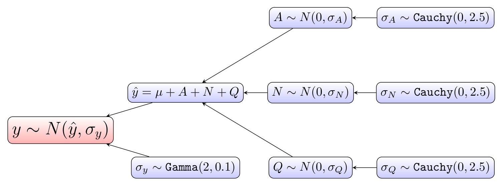

```{r setup, include=FALSE}
knitr::opts_chunk$set(echo = TRUE)
```

# Introduction

For this example, use hierarchical modelling to study housing prices. For our data, we'll use the *Ames Housing Data* dataset. This contains data on housing prices in Ames, Iowa. It and its documentation can be found at the following urls: 

* [http://www.amstat.org/publications/jse/v19n3/decock/AmesHousing.xls](http://www.amstat.org/publications/jse/v19n3/decock/AmesHousing.xls)

* [http://www.amstat.org/publications/jse/v19n3/decock/DataDocumentation.txt](http://www.amstat.org/publications/jse/v19n3/decock/DataDocumentation.txt)

First we'll load the required libraries for this project. We'll be using the R implementation of STAN for our modelling.

```{r, message = FALSE, warning = FALSE}

library(caret)
library(rstan)
library(bridgesampling)
library(dplyr)
library(ggplot2)
library(tidyr)

```

Now we'll load our data. For this project we'll study how the distributions of house prices vary by neighborhood. Note there is information for 28 neighborhoods and 2930 houses. The mean home price for this data is approximately $181,000. We'll also create a list of full names of the neighborhoods which can be found in the documentation.

```{r}

Houses <- read.csv("AmesHousing.csv") %>% mutate(SalePrice = SalePrice / 1000)

Neighborhood_array <- c("Bloomington Heights", "Bluestem", "Briardale", "Brookside", "Clear Creek", "College Creek", "Crawford", "Edwards", "Gilbert", "Greens", "Green Hills", "Iowa DOT and Rail Road", "Landmark", "Meadow Village", "Mitchell", "North Ames", "Northridge", "Northpark Villa", "Northridge Heights", "Northwest Ames", "Old Town", "South & West of Iowa State University", "Sawyer", "Sawyer West", "Somerset", "Stone Brook", "Timberland", "Veenker")


```

First lets just examine the distribution of prices for the first several neighborhoods.

```{r}

levels(Houses$Neighborhood) <- Neighborhood_array

Houses %>% filter(Neighborhood %in% c("Bloomington Heights", "Bluestem", "Briardale", "Brookside", "Clear Creek", "College Creek")) %>%
  ggplot(aes(x=SalePrice)) + geom_density(fill = "red") + facet_wrap(~Neighborhood, ncol = 3) + xlab("Sale Price (in thousands of dollars)")

```

# Crossed Hierarchical Model

Now we'll implement a crossed hierarchical model.

We'll be adding a predictor so to see which ones are important, we'll use a conditional inference tree from the caret library to examine variable importance in predicting price. Note first we remove the columns with many missing values and then rows with missing values that remain.

```{r, message = FALSE, warning = FALSE}
library(caret)

Houses <- Houses %>% select(-Order, -PID, -Alley, -Fireplace.Qu, -Garage.Finish, -Garage.Qual, -Garage.Cond, -Pool.QC, -Fence, -Misc.Feature, -Lot.Frontage, -Garage.Type, -Garage.Yr.Blt) %>% na.omit()

set.seed(1234)

mod <- train(SalePrice ~ ., data = Houses, method = "ctree")
varImp(mod)

```

This suggests *Overall.Qual* is the most important so we'll use it in our model. Note this is a discrete variable that takes integers values from 1 to 10 and describes the overall quality of the house with 10 being the highest quality. Also we'll use *Gr.Liv.Area*. This is the floor area of the house on the ground level. To use it in our model, we will convert it into a discrete variable by changing each sample's value to its corresponding quartile. 

Now we'll reload our data and select the columns we're interested in. Also we'll transform the neighborhood names into integers. 

```{r}

Houses <- read.csv("AmesHousing.csv") %>%
  mutate(Neighborhood = as.numeric(Neighborhood), SalePrice = SalePrice / 1000, Gr.Liv.Area = ntile(Gr.Liv.Area, 4)) %>%
  select(SalePrice, Neighborhood, Overall.Qual, Gr.Liv.Area) %>% na.omit()

```

To model our data, we’ll use a crossed-hierarchical model. Crossed-hierarchical models are useful when we have more than one partitioning of the data. Note the partitions are imbalanced for our data so like for the electricity example, hierarchical Bayes allows us to borrow strength from the likelihood of other partitions. For our crossed-hierarchical model, the intercept represents the average house price and a parameter is added to represent the deviation from this average for each of the three grouping variables. Below is a hierarchical diagram of how the model is constructed. Here is the STAN code for our model.

```{r}

crossed_stan_code <- 

"

data {
  int<lower=0> m; // number of observations
  int<lower=1,upper=10> q_id[m]; // quality index for each observation
  int<lower=1,upper=28> n_id[m]; // neighborhood index for each observation
  int<lower=1,upper=28> a_id[m]; // area index for each observation
  vector[m] y; // house price for each observation
}
parameters {
  real<lower=0> mu; // average house price value. the intercept in this model

  vector[10] Q; // vector of quality deviations from the average
  real<lower=0> sigma_Q; // standard deviation of the Q coefficients

  vector[28] N; // vector of neighborhood deviations from the average
  real<lower=0> sigma_N; // standard deviation of the N coefficients

  vector[4]  A; // vector of area quantile deviations from the average
  real<lower=0> sigma_A; // standard deviation of the A coefficients

  real<lower=0> sigma_y; // standard deviation of all the observations
}
transformed parameters {
  vector[m] y_hat;

  // fits the deviation from the average home price of each category to each observation  
  for (i in 1:m)
    y_hat[i] = mu + Q[q_id[i]] + N[n_id[i]] + A[a_id[i]];
}
model {
  // priors 
  Q ~ normal(0, sigma_Q);
  sigma_Q ~ cauchy(0,2.5);

  N ~ normal(0, sigma_N);
  sigma_N ~ cauchy(0,2.5);

  A ~ normal(0, sigma_A);
  sigma_A ~ cauchy(0,2.5);

  sigma_y ~ gamma(2,0.1);

  // the likelihood
  y ~ normal(y_hat, sigma_y);
}

"

```

Here is a hierarchical diagram of the model.



The model estimates the deviation from average home price, mu, for each partition of the following partitionings of the data: A (the ground floor area quartile), N (the neighborhood), and Q (the quality rating). The model was run with 1000 iterations of MCMC (Markov Chain Monte Carlo) and two chains. The trace of the standard deviation of all observations in our MCMC model is shown below.

Now we'll train our model. Note we are using Markov chain Monte Carlo (MCMC) to increase our sample size. The *chains* parameter specifies the number of Markov chains and the *iter* parameter specifies the number of iterations for each chain.

```{r}

set.seed(1234)

dat<-list(m = nrow(Houses), q_id = Houses$Overall.Qual, n_id = Houses$Neighborhood, a_id = Houses$Gr.Liv.Area, y = Houses$SalePrice)
mod <-stan(model_code = crossed_stan_code , data=dat, iter=1000, chains=2, control = list(max_treedepth = 12))

```

We received no errors! Now we'll examine the trace of *sigma_y* (the standard deviation of all the observations) in our MCMC model. At first glance, sigma_y appears to not be converging, but the values are actually all very close to 35. Now we’ll examine the distributions of the deviations from the average home price for each parameter.

```{r}

stan_trace(mod, pars = c("sigma_y"))

```

Now we'll extract out out samples produced and put them in a dataframe.

```{r}

crossed_samples <- as.data.frame( mod@sim$samples )  %>% select(Q.1. : A.4.)

Quals <- crossed_samples %>% select(Q.1. : Q.10.) %>%
  gather(key = Qual, value = SalePrice) %>% 
  mutate(Qual = as.numeric( gsub("[^0-9]", "", Qual)))

Neighborhoods <- crossed_samples %>% select(N.1. : N.28.) %>%
  gather(key = Neighborhood, value = SalePrice) %>% 
  mutate(Neighborhood = as.numeric( gsub("[^0-9]", "", Neighborhood)))

Areas <-crossed_samples %>% select(A.1. : A.4.) %>%
  gather(key = Area_quartile, value = SalePrice) %>% 
  mutate(Area_quartile = as.numeric( gsub("[^0-9]", "", Area_quartile)))

```

Now we'll look at the deviation from the mean home price for each quality class. Here we see quality rating and home price are highly correlated. This provides a sanity check for our model as it supports the results obtained from the conditional inference tree earlier.   Also it is interesting to note this suggests a quality rating of 8 or higher is required to necessitate a significantly above average home price.


```{r}

Quals %>%  ggplot(aes(x = factor(Qual), y = SalePrice)) +
  geom_violin(fill = "blue", alpha = 0.3) +
  geom_boxplot(width=0.1) +
  geom_hline(aes(yintercept=0), colour="red", linetype="dashed") +
  xlab("Overall Quality Ranking") +
  ylab("Deviation from Average Home Price (in 1000s)")

```

Now we'll do the same thing only for the neighborhoods. Note the neighborhoods appear to be quite segregated by home price and some neighborhoods such as Green Hills and Landmark contain a much wider range of home prices.

```{r}

Neighborhoods$Neighborhood <- as.factor(Neighborhoods$Neighborhood)
levels(Neighborhoods$Neighborhood) <- Neighborhood_array

Neighborhoods %>%  ggplot(aes(x = Neighborhood, y = SalePrice)) +
  geom_violin(fill = "blue", alpha = 0.3) +
  geom_hline(aes(yintercept=0), colour="red", linetype="dashed") +
  theme(axis.text.x = element_text(angle = 45, hjust = 1, vjust = 1), plot.margin = margin(10, 10, 10, 20)) +
  ylab("Deviation from Average Home Price (in 1000s)")

```

Finally for the quartiles of total ground floor area.

```{r}

Areas %>%  ggplot(aes(x = factor(Area_quartile), y = SalePrice)) +
  geom_violin(fill = "blue", alpha = 0.3) +
  geom_boxplot(width=0.1) +
  geom_hline(aes(yintercept=0), colour="red", linetype="dashed") +
  xlab("Quartile of Ground Floor Area") +
  ylab("Deviation from Average Home Price (in 1000s)")

```

Now we'll try a non-hierarchical normal model and compare it to to the hierarchical model.

```{r}

non_hier_stan_code <- 

"
data {
  int<lower=0> m; // number of observations
  int<lower=1,upper=10> q_id[m]; // quality index for each observation
  int<lower=1,upper=28> n_id[m]; // neighborhood index for each observation
  int<lower=1,upper=28> a_id[m]; // area index for each observation
  vector[m] y; // house price for each observation
}
parameters {
  real<lower=0> mu; // average house price value. the intercept in this model
  real<lower=0> sigma_y; // standard deviation of all the observations
}
model {
  // priors 
  sigma_y ~ gamma(2,0.1);

  // the likelihood
  y ~ normal(mu, sigma_y);
}

"

```

```{r}

set.seed(1234)

non_hier_mod <-stan(model_code = non_hier_stan_code , data=dat, iter=1000, chains=2, control = list(max_treedepth = 12))

```

To compare the the models, we can compute the Bayes factor by using the *bf* function in the *bridgesampling* package. Here we compute the Bayes factor, which quantifies how much more likely the data is under the hierarchical model versus the non-hierarchical model.


```{r}

set.seed(1234)

mod.bridge <- bridge_sampler(mod, silent = TRUE)
non_hier_mod.bridge <- bridge_sampler(non_hier_mod, silent = TRUE)
bf(mod.bridge, non_hier_mod.bridge)

```

##References

1. Cock, D. [*Ames, Iowa: Alternative to the Boston Housing Data as an End of Semester Regression Project*](https://ww2.amstat.org/publications/jse/v19n3/decock.pdf)
2. Fonnesbeck, C. [*A Primer on Bayesian Multilevel Modeling using PyStan*](http://mc-stan.org/users/documentation/case-studies/radon.html)
3. Harris, M. [*Estimating a beta distribution with STAN*](https://matthewdharris.com/2016/10/18/estimating-a-beta-distribution-with-stan-hmc/)
4. Hertzog, L. [*Hierarchical models with RSTAN part 1*](https://biologyforfun.wordpress.com/2016/11/10/hierarchical-models-with-rstan-part-1/)
5. Ozaki, T. [*Bayesian modeling with R and Stan (3): Simple hierarchical Bayesian model*](http://tjo-en.hatenablog.com/entry/2015/08/04/190000)
